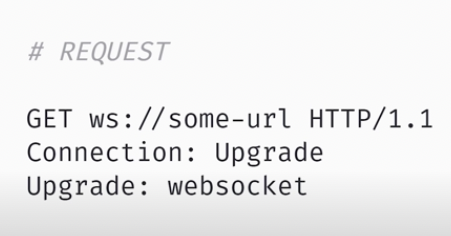
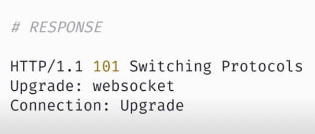

# Websockets {

## Intro

Websocket nos permite crear aplicaciones en tiempo real estableciendo una conexión entre un cliente y un servidor.

Cuando construimos una aplicación dónde necesitamos una información sincronizada con el resto de usuarios (como por ejemplo, un chat, Netflix, maps, etc) podemos pulsar refresh cada pocos segundos o establecer un método que refresque el contenido cada pocos segundos. Ninguna de estas opciones es ideal: por ello empleamos websockets.

El primer paso es que el cliente estableza una conexión con el servidor mediante una petición HTTP solicitando abrir una conexión de websocket.

<p align="center">
  
</p>

Si el servidor acepta la petición, establecerá una respuesta 101 switching protocols.

<p align="center">
  
</p>

En este punto se habrá establecido una conexiónn de tipo TCP/IP: Protocolo de control de transmisión/Protocolo de Internet. TCP/IP es un conjunto de reglas estandarizadas que permiten a los equipos comunicarse en una red como Internet.

<p align="center">
  
</p>

Esta conexión permite establecer envíos bilaterales de información entre las distintas partes. Este canal de información permanecerá abierto hasta que alguno de los implicados se cierre.

Para crear un ejemplo práctico vamos a inicar dos proyectos: un server y una app. Para el server emplearemos el [paquete de npm ws](https://www.npmjs.com/package/ws) y nuestra app correrá mediante [parcel](https://www.npmjs.com/package/parcel).

## Server

```bash
mkdir intro
cd intro
mkdir server app
cd server
touch index.js
yarn init -y
yarn add ws eslint nodemon
yarn eslint --init
```

> package.json

```json
{
	"name": "server",
	"version": "1.0.0",
	"main": "index.js",
	"license": "MIT",
	"scripts": {
		"dev": "nodemon src/server.ts"
	},
	"dependencies": {
		"nodemon": "^2.0.20",
		"ws": "^8.10.0"
	},
	"devDependencies": {
		"eslint": "^8.26.0",
		"eslint-config-airbnb-base": "^15.0.0",
		"eslint-plugin-import": "^2.26.0"
	}
}
```

> index.js

```js
const WebSocket = require('ws');

// Iniciamos un nuevo servidor en el puerto 3001:
const server = new WebSocket.Server({ port: '3001' });

// El primer evento esperado es una conexión desde cliente. Cuando la conexión se establece
// tendremos acceso al objecto websocket en el callback:
server.on('connection', (socket) => {
	console.log('estado del servidor: conectado');
	// Escuchando mensajes:
	socket.on('message', (message) => {
		// Enviando mensajes al cliente
		console.log('estado del servidor: enviando mensaje');
		socket.send(`🚀 ${message}`);
	});
});
```

## APP

Ahora vayamos al código de cliente que ejecutaremos desde un navegador:

```bash
cd app
touch app.js index.html
yarn init -y
yarn add eslint parcel
yarn eslint --init
```

> package.json

```json
{
	"name": "app",
	"version": "1.0.0",
	"main": "index.js",
	"license": "MIT",
	"scripts": {
		"dev": "parcel index.html"
	},
	"devDependencies": {
		"eslint": "^8.26.0",
		"eslint-config-airbnb-base": "^15.0.0",
		"eslint-plugin-import": "^2.26.0"
	},
	"dependencies": {
		"parcel": "^2.7.0"
	}
}
```

> app.js

```js
// Establecemos conexión mediante el protocolo ws al servidor iniciado
const socket = new WebSocket('ws://localhost:3001');

socket.onmessage = ({ data }) => {
	// Escuchar mensajes
	console.log('Mensaje recibido del servidor:', data);
};

document.getElementById('button').onclick = () => {
	// Enviar mensajes
	socket.send('Hello world!');
};
```

> index.html

```html
<!DOCTYPE html>
<html lang="en">
	<head>
		<meta charset="UTF-8" />
		<meta http-equiv="X-UA-Compatible" content="IE=edge" />
		<meta name="viewport" content="width=device-width, initial-scale=1.0" />
		<title>Document</title>
	</head>
	<body>
		<button id="button">Click me!</button>
		<script src="app.js"></script>
	</body>
</html>
```

## Chat APP

Vamos a preparar nuestro proyecto con un front (dónde l@s usuari@s podrá ver los componentes del chat en el navegador) y un back ó, más concretamente, API que haga las veces de servidor y devuelva la información solicitada a los participantes del chat (es decir, que devuelva los mensajes del resto de usuarios).

```bash
mkdir packages
cd packages
mkdir api front
```

> Importate no olvidar crear un archivo [.gitignore](https://www.toptal.com/developers/gitignore)

## API

En primer lugar vamos a centrarnos en el proyecto API.

> `API`: Es un acrónimo que hace referencia interfaz de programación de aplicaciones. Una API establece un conjunto de subrutinas, funciones y procedimientos que permiten la comunicación entre dos o más componentes de software distintos.

En la raíz de nuestro proyecto API vamos a añadir yarn como gestor de paquetes de npm y eslint para que nuestro código siga una guía de estilos:

```bash
yarn init -y
yarn add eslint
yarn eslint --init
```

Una vez configuradas las bases del proyecto (yarn y eslint), vamos a instalar los paquetes o dependencias, comenzando por typescript:

```bash
yarn add typescript
tsc --init
```

> `Typescript` es un lenguaje fuertemente tipado construido por encima de javascript, proporcionando al desarrollador herramientas que permiten desarrollar un código mas robusto, escalable y mantenible.

Y ahora instalamos todos los paquetes que nuestra API necesitará:

```bash
yarn add nodemon ts-node fastify dotenv @types/node
```

Y por último vamos a crear las carpetas y archivos que necesitará nuestro proyecto (servidor, configuración, app y rutas):

```bash
mkdir src
cd src
touch server.ts config.ts app.ts
mkdir routers
cd routers
touch  main_router.ts
```

## Fastify

> `Fastify`: Es un paquete de npm que nos permite, de manera fácil y totalmente integrada con typescript, crear y arrancar un servidor en nuestro propio ordenador. Además es un paquete altamente configurable mediante pluggins: algunos propios de los mismos desarrolladores y otros los podremos crear nosotros mismos.

Antes de nada, vamos a establecer unas cuantas configuraciones previas a nuestro proyecto. En la raíz del mismo vamos a crear un archivo `.env` dónde almacenar toda la información sensible o configurable (puertos, keys, etc), del mismo modo que indicaremos en `package.json` los scripts necesarios y las reglas que queramos desactivar de nuestra guía de estilos de `eslint`:

> package.json

```json
{
	"name": "api",
	"version": "1.0.0",
	"main": "index.js",
	"license": "MIT",
	"scripts": {
		"dev": "nodemon src/server.ts"
	},
	"devDependencies": {
		"@typescript-eslint/eslint-plugin": "^5.41.0",
		"@typescript-eslint/parser": "^5.41.0",
		"eslint": "^8.26.0",
		"eslint-config-airbnb-base": "^15.0.0",
		"eslint-plugin-import": "^2.26.0"
	},
	"dependencies": {
		"@types/node": "^18.11.5",
		"@types/pino": "^7.0.5",
		"dotenv": "^16.0.3",
		"fastify": "^4.9.2",
		"nodemon": "^2.0.20",
		"pino": "^8.7.0",
		"pino-pretty": "^9.1.1",
		"typescript": "^4.8.4"
	}
}
```

> .eslintrc.json

```json
"rules": {
		"react/function-component-definition": "off",
		"react/jsx-filename-extension": "off",
		"camelcase": "off",
		"import/prefer-default-export": "off",
        "import/no-unresolved": "off",
        "import/extensions": "off"
	}
```

> .env

```bash
PORT=3001
```

En el archivo `config.ts` establecemos una función que verifique si hemos configurado correctamente las variables en el archivo .env:

> config.ts

```ts
/* eslint-disable import/prefer-default-export */
import dotenv from 'dotenv';

dotenv.config();

const checkEnv = (envVar: string) => {
	if (!process.env[envVar]) {
		throw new Error(`Please define the Enviroment variable ${envVar}`);
	} else {
		return process.env[envVar] as string;
	}
};

export const PORT: number = parseInt(checkEnv('PORT'), 10);
```

En el archivo `server.ts` arrancamos nuestro servidor mediante `fastify()`. En el mismo archivo registramos las acciones que queremos que ejecute el servidor, como por ejemplo nuestra aplicación principal app.ts y el PORT que escuchará:

> server.ts

```ts
import fastify from 'fastify';
import main_app from './app';
import { PORT } from './config';

const server = fastify({
	logger: true,
});

server.register(main_app);

server.listen({ port: PORT });
```

En el archivo `app.ts` definimos la aplicación principal (diferenciándola del servidor) la cual registra sobre el mismo las rutas seleccionadoas, como `main_router`:

> app.ts

```ts
import { FastifyPluginAsync } from 'fastify';
import main_router from './routers/main_router';

const main_app: FastifyPluginAsync = async (app) => {
	app.register(main_router);
};

export default main_app;
```

En el archivo `main_router.ts` ejecutamos un get de la ruta:

> main_router.ts

```ts
import { FastifyPluginAsync } from 'fastify';

const main_router: FastifyPluginAsync = async (app) => {
	app.get('/', async () => ({ hello: 'world' }));
};

export default main_router;
```

## FRONT

En la raíz de nuestro proyecto FRONT vamos a añadir yarn como gestor de paquetes de npm y eslint para que nuestro código siga una guía de estilos:

```bash
yarn init -y
yarn add eslint
yarn eslint --init
```

Una vez configuradas las bases del proyecto (yarn y eslint), vamos a instalar los paquetes o dependencias, comenzando por typescript:

```bash
yarn add typescript
tsc --init
```

Y ahora instalamos todos los paquetes que nuestro FRONT necesitará:

```bash
yarn add dotenv react react-dom next @types/react @types/react-dom @types/node
```

Y por último vamos a crear las carpetas y archivos que necesitará nuestro proyecto (componentes, páginas, etc):

```bash
mkdir pages components
cd pages
touch index.tsx
```

## Next

Del mismo modo que se emplea PARCEL como un bandler (herramienta previamente configurada que nos permitía compilar y ejecutar una app de manera simplificada) vamos a emplear otro bundler para react (aunque lo podemos encontrar en otros proyectos de JS): nextjs.

[nextjs](https://nextjs.org/): es un bandler muy popular y muy sencillo de implementar que, a diferencia de parcel, me va a permitir hacer una página en react con múltiples pantallas. Es decir, en esta ocasión podremos emplear un router o sistema de navegación entre páginas.

Antes de nada, vamos a establecer unas cuantas configuraciones previas a nuestro proyecto. En la raíz del mismo vamos a crear un archivo `.env` dónde almacenar toda la información sensible o configurable (puertos, keys, etc), del mismo modo que indicaremos en `package.json` los scripts necesarios y las reglas que queramos desactivar de nuestra guía de estilos de `eslint`:

> package.json

```json
{
	"name": "front",
	"version": "1.0.0",
	"main": "index.js",
	"license": "MIT",
	"scripts": {
		"dev": "next dev",
		"build": "next build",
		"start": "next start",
		"lint": "next lint"
	},
	"devDependencies": {
		"@typescript-eslint/eslint-plugin": "^5.41.0",
		"@typescript-eslint/parser": "^5.41.0",
		"eslint": "^8.26.0",
		"eslint-config-airbnb": "^19.0.4",
		"eslint-plugin-import": "^2.26.0",
		"eslint-plugin-jsx-a11y": "^6.6.1",
		"eslint-plugin-react": "^7.31.10",
		"eslint-plugin-react-hooks": "^4.6.0"
	},
	"dependencies": {
		"@types/node": "^18.11.5",
		"@types/react": "^18.0.23",
		"@types/react-dom": "^18.0.7",
		"next": "^13.0.0",
		"react": "^18.2.0",
		"react-dom": "^18.2.0",
		"typescript": "^4.8.4"
	}
}
```

> .eslintrc.json

```json
"rules": {
		"react/function-component-definition": "off",
		"react/jsx-filename-extension": "off",
		"camelcase": "off",
		"import/prefer-default-export": "off",
        "import/no-unresolved": "off",
        "import/extensions": "off"
	}
```

Creamos un archivo `.env`

> .env

```bash
NEXT_PUBLIC_SOCKET_URL=localhost:3001
```

Creamos un componente en el index

> pages/index.tsx

```tsx
import React from 'react';

const ChatPage = () => {
	console.log('Hello from nextjs');
	return <p>Welcome to our chat</p>;
};

export default ChatPage;
```

Si ejecutamos `yarn run dev` veremos que tenemos un servidor corriendo en el puerto 3000 (puerto por defecto de next) con nuestro componente por pantalla.

## Componets

El componente Message pinta cada uno de los mensajes:

> Message.tsx

```tsx
import React from 'react';

export const Message = ({ children }: any) => (
	<div style={{ margin: '10px', display: 'flex', justifyContent: 'flex-end' }}>
		<div
			style={{
				padding: '5px',
				backgroundColor: 'gray',
				color: 'white',
				borderRadius: '15px',
			}}
		>
			{children}
		</div>
	</div>
);
export default Message;
```

El componente Message engloba todos los mensajes de la lista y los renderiza:

> Chat.tsx

```tsx
/* eslint-disable react/no-array-index-key */
import React from 'react';
import Message from './Message';

const messages = [{ text: 'Welcome 👋' }];

const Chat = () => {
	console.log('CHATCMP');
	return (
		<div
			style={{ border: '1px solid red', padding: '10px', minWidth: '400px' }}
		>
			{messages.map((msg, i) => (
				<div key={i}>
					<Message>{msg.text}</Message>
				</div>
			))}
		</div>
	);
};

export default Chat;
```

Página princial:

> index.tsx

```tsx
import React from 'react';
import Chat from '../components/Chat';

const ChatPage = () => (
	<div
		style={{ display: 'flex', flexDirection: 'column', alignItems: 'center' }}
	>
		<h1>FemCoders: The Chat ❤️</h1>
		<Chat />
	</div>
);

export default ChatPage;
```

## React-sweet-state

> `React-sweet-state`: es una librería en ciertos aspectos más flexible que REDUX porque nos permite ejecutar acciones de manera concreta y con menos código (de una manera simplificada, por así decirlo).

Vamos a incorporar `react-sweet-state` para añadir un store con un hook en una nueva carpeta lib con un file useChat.ts.

```bash
mkdir lib
cd lib
touch useChat.ts
```

```bash
yarn add react-sweet-state
```

Nuestro nuevo state se compone de:

- Una `lista de mensajes previos` configurados en el chat
- Un `action sendLocalMessage` que recibirá un parámetro text
- El action cogerá los messages actuales desde el `getState()` y los almacenará en la variable currentMessages
- Actualizará el state (los menssages existentes) mediante `setState()` añadiendo el texto que hemos recibido como parámetro.

> lib/useChat.ts

```ts
import { createStore, createHook } from 'react-sweet-state';

const Store = createStore({
	initialState: {
		messages: [{ text: 'Welcome 👋' }],
	},
	actions: {
		sendLocalMessage:
			(text) =>
			({ setState, getState }) => {
				const currentMessages = getState().messages;
				console.log('Sending local message', text);
				setState({
					messages: [...currentMessages, { text }],
				});
			},
	},
	name: 'chat',
});

const useChat = createHook(Store);

export default useChat;
```

Ahora podemos hacer que el componente Chat saque los mensajes que mapea del hook useChat:

> Chat.tsx

```tsx
/* eslint-disable react/no-array-index-key */
import React from 'react';
import Message from './Message';
import useChat from '../lib/useChat';

const Chat = () => {
	console.log('CHATCMP');
	const [{ messages }] = useChat();
	return (
		<div
			style={{ border: '1px solid red', padding: '10px', minWidth: '400px' }}
		>
			{messages.map((msg, i) => (
				<div key={i}>
					<Message>{msg.text}</Message>
				</div>
			))}
		</div>
	);
};

export default Chat;
```

## Input component

Ahora vamos a crear un nuevo componente input. Lo más interesante de este componente es que añadiremos `useState` que controle el texto del input según hagamos cambios en el target del input. Añadiremos también un `useEffect` que detecte y actulice el cambio cuando pulsemos Enter.

```bash
cd components
touch Input.tsx
```

> Input.tsx

```tsx
/* eslint-disable no-unused-vars */
import React, { useState, useEffect } from 'react';
import useChat from '../lib/useChat';

const Input = () => {
	const [text, setText] = useState('');
	const [_, { sendLocalMessage }] = useChat();

	const handleSend = () => {
		sendLocalMessage(text);
		setText('');
	};

	useEffect(() => {
		// fn será la función que asociaremos al evento addEventListener keydown
		// Pero si cambia el text (parámetro de useEffect) desasocia el evento (con el return)
		// y genera un nuevo addEventListener
		const fn = (e: any) => {
			if (e.key === 'Enter') {
				handleSend();
			}
		};
		window.addEventListener('keydown', fn);
		return () => {
			window.removeEventListener('keydown', fn);
		};
	}, [text]);
	return (
		<div style={{ display: 'flex', height: '40px' }}>
			<input
				style={{ width: '70%', padding: '0 10px' }}
				value={text}
				onChange={(e) => setText(e.target.value)}
				placeholder="Enter text here to chat"
			/>
			<button
				style={{ width: '30%' }}
				type="button"
				onClick={() => handleSend()}
			>
				Send
			</button>
		</div>
	);
};

export default Input;
```

Y ahora podemos importar nuestro nuevo componente al Chat:

> Chat.tsx

```tsx
/* eslint-disable react/no-array-index-key */
import React from 'react';
import Message from './Message';
import useChat from '../lib/useChat';
import Input from './Input';

const Chat = () => {
	console.log('CHATCMP');
	const [{ messages }] = useChat();
	return (
		<div
			style={{ border: '1px solid red', padding: '10px', minWidth: '400px' }}
		>
			{messages.map((msg, i) => (
				<div key={i}>
					<Message>{msg.text}</Message>
				</div>
			))}
			<Input />
		</div>
	);
};

export default Chat;
```

## Chat API

Vamos a implementar la tecnología websocket tanto en front como en back. Para ello vamos a emplear una librería llamada [socket.io](https://socket.io/).

`Websocket` es una tecnología que abre un canal bidireccional de comunicación entre el cliente (navegador, postman...) y servidor. Mediante websocket un usuario puede enviar data al servidor al mismo tiempo que recibe dicha data desde el servidor.

Pongamos por ejemplo el `protocolo http`: este nos permitía lanzar request bajo GET o POST y recibir una única respuesta. No obstante siempre debía cumplirse `1 request = 1 response`.

No obstante, bajo el `protocolo websocket` se abre una conexión entre el front y el back que les permite mandarse información en cualqueir dirección en cualquier momento (están constantemente escuchando).

`socket.io` es una librería que nos ayudará a implementar websocket de una manera mucho más rápida y sencilla ya que otorga toda una capa de utilidades para establecer conexión entre node y lso servidores sin casi necesidad de conocimientos previos.

## Websocket on API

En primer lugar vamos a configurar websocket en la parte de la api. Para ello vamos a seguir las instrucciones del chat de [socket](https://socket.io/get-started/chat).

Ya que nuestro back recibirá peticiones del front, necesitaremos autorizar las mismas con fastify-cors:

> `CORS`: Nosotros tenemos una web corriendo en localhost:3000 y otra en localhost:3001. ¿Qué ocurre? Como es una web haciendo una petición a otra con dominio distinto `se activa la protección del nevagor cors`: Cross-Origin Resource Sharing (secure cross-origin requests).
>
> Por defecto, los navegadores permiten enlazar hacia documentos situados en todo tipo de dominios si lo hacemos desde el HTML o desde Javascript utilizando la API DOM (que a su vez está construyendo un HTML). Sin embargo, no ocurre lo mismo cuando se trata de peticiones HTTP asíncronas mediante Javascript (AJAX), sea a través de XMLHttpRequest, de fetch o de librerías similares para el mismo propósito.
>
> Utilizando este tipo de peticiones asíncronas, los recursos situados en dominios diferentes al de la página actual no están permitidos por defecto. Es lo que se suele denominar protección de CORS. Su finalidad es dificultar la posibilidad de añadir recursos ajenos en un sitio determinado.
>
> Para evitar esto, vamos a configurar el pluggin [fastify-cors](https://github.com/fastify/fastify-cors) el cual setea información en el header y permite que cualquier persona pueda hacer una petición a nuesta página.

```bash
yarn add @fastify/cors
```

> app.ts

```ts
import { FastifyPluginAsync } from 'fastify';
import fscors from '@fastify/cors';
import main_router from './routers/main_router';

const main_app: FastifyPluginAsync = async (app) => {
	app.register(main_router);
	app.register(fscors);
};

export default main_app;
```

A continuación generaremos un nuevo fichero websocket dónde `se iniciará nuestro nuevo servidor que estará escuchando en el mismo servidor que fastify`. Como veremos a continuación, sobre el servidor de fastify añadiremos un pluggin:

```bash
yarn add socket.io
```

```bash
cd src
touch ws.ts
```

> src/ws.ts

```ts
import { Server, Socket } from 'socket.io';
import { FastifyInstance } from 'fastify';

// "Nuevo" servidor de websocket
export const start_ws_server = async (app: FastifyInstance) => {
	const io = new Server(app.server, {
		cors: {
			origin: true,
		},
	});
	app.log.info('Starting websockets server side');

	io.on('connection', (socket: Socket) => {
		app.log.info('Received connection from frontend');

		// Cuando reciba un mensaje en el canal message ejecutará la siguiente acción:
		socket.on('message', (msg) => {
			app.log.info('RECEIVED MESSAGE; SEND REPLY');
			app.log.info(msg);
			// broadcast: emite un mensaje a todos los clientes conectados excepto al sender
			socket.broadcast.emit('message', {
				text: `🚀 ${msg.text}`,
			});
		});
	});
};
```

Podemos obtener más información sobre [broadcasting](https://socket.io/docs/v3/broadcasting-events/) desde la documentación oficial.

En último lugar sólo debemos añadir nuestra configuración como `un plugin` más del servidor de fastify:

> server.ts

```ts
import fastify from 'fastify';
import main_app from './app';
import { PORT } from './config';
import { start_ws_server } from './ws';

const server = fastify({
	logger: true,
});

server.register(main_app);
server.register(start_ws_server);

server.listen({ port: PORT });
```

## Websocket on CLIENT

Ahora queda la otra parte: configurar nuestro websocket.io desde el cliente para que haga las peticiones oportunas. Lo primero será instalar el [paquete socket.io-client](https://www.npmjs.com/package/socket.io-client) correspondiente en el front:

```bash
yarn add socket.io-client
```

Si seguimos la [documentación](https://socket.io/docs/v4/client-api/) deberemos, en el componente useChat, añadir:

> useChat.ts

```ts
import { io, Socket } from 'socket.io-client';
```

Dentro de las acciones actuales vamos a crear una nueva llamada `connectWebsocket` la cual:

- Devolverá un Action de tipo State
- Obtendrá información de la variable global NEXT_PUBLIC_SOCKET_URL
- Iniciará un nuevo socket
- Añadirá el socket al servidor

> `Dispatch`: Es una función que permite lanzar acciones (actions) al store, con la intención de afectar el estado.

> useChat.ts

```ts
import { createStore, createHook, Action } from 'react-sweet-state';
import { io, Socket } from 'socket.io-client';

type State = {
	messages: Array<any>;
	socket?: Socket;
};

const Store = createStore({
	initialState: {
		messages: [{ text: 'Welcome 👋' }],
	},
	actions: {
		sendLocalMessage:
			(text) =>
			({ setState, getState }) => {
				const currentMessages = getState().messages;
				console.log('Sending local message', text);
				setState({
					messages: [...currentMessages, { text }],
				});
			},
		connectWebsocket:
			(): Action<State> =>
			({ setState, dispatch, getState }) => {
				console.log('Connecting websocket');
				const websocket_url = process.env.NEXT_PUBLIC_SOCKET_URL || '';
				// Initialize socket
				const socket: Socket = io(websocket_url, {
					reconnectionDelayMax: 10000,
				});
				// Set socket objet in the store
				setState({ socket });
			},
	},
	name: 'chat',
});

const useChat = createHook(Store);

export default useChat;
```

Ya estaría listo. Ahora vamos a añadir dos salvaguardas:

1. Que detecte si el socket ha sido iniciado (ya que lo tenemos almacenado en la store)
2. Si existe la variable de entorno

> useChat.ts

```ts
/* eslint-disable no-unused-vars */
import { createStore, createHook, defaults, Action } from 'react-sweet-state';
import { io, Socket } from 'socket.io-client';

type State = {
	messages: Array<any>;
	socket?: Socket;
};

const Store = createStore({
	initialState: {
		messages: [
			{ text: 'Hello' },
			{ text: 'Bye!' },
			{ text: 'Bye!' },
			{ text: 'Bye!' },
			{ text: 'Hello' },
		],
	},
	actions: {
		sendLocalMessage:
			(text) =>
			({ setState, getState }) => {
				const currentMessages = getState().messages;
				console.log('Sending local message', text);
				setState({
					messages: [...currentMessages, { text }],
				});
			},
		connectWebsocket:
			(): Action<State> =>
			({ setState, dispatch, getState }) => {
				console.log('Connecting websocket');

				// Check if socket is aleady connected
				const state = getState();
				if (state.socket && state.socket.connected) {
					console.warn('Socket is already connected');
					return;
				}

				//  Check enviroment vars
				const websocket_url = process.env.NEXT_PUBLIC_SOCKET_URL;
				if (!websocket_url) {
					throw new Error(
						'Bad next.js configuration, please define the NEXT_PUBLIC_SOCKET_URL env variable'
					);
				}
				console.log('Starting ws connection on', websocket_url);

				// Initialize socket
				const socket: Socket = io(websocket_url, {
					reconnectionDelayMax: 10000,
				});
				// Set socket objet in the store
				setState({ socket });
			},
	},
	name: 'chat',
});

const useChat = createHook(Store);

export default useChat;
```

Ahora solo debemos ejecutar `connectWebsocket` desde el componente Chat:

> Chat.tsx

```ts
/* eslint-disable react/no-array-index-key */
import React, { useEffect } from 'react';
import Message from './Message';
import useChat from '../lib/useChat';
import Input from './Input';

const Chat = () => {
	console.log('CHATCMP');
	const [{ messages }, { connectWebsocket }] = useChat();

	useEffect(() => {
		connectWebsocket();
	}, []);

	return (
		// (...)
	);
};

export default Chat;
```

## socket.on(eventName, callback)

Ya tenemos nuestro socket en local conectado al socket de la api. Ahora vamos a emitir los mensajes. Para ello emplearemos la función [socket.on(eventName, callback)](https://socket.io/docs/v4/client-api/#socketoneventname-callback) que espera un name del evento y una función como callback. socket.on registrará un nuevo canal para un evento dado. Los canales son connect, disconnect y message.

> useChat.tsx

```tsx
import { createStore, createHook, Action } from 'react-sweet-state';
import { io, Socket } from 'socket.io-client';

type State = {
	messages: Array<any>;
	socket?: Socket;
};

const Store = createStore({
	initialState: {
		messages: [{ text: 'Welcome 👋' }],
	},
	actions: {
		sendLocalMessage:
			(text) =>
			({ setState, getState }) => {
				const currentMessages = getState().messages;
				console.log('Sending local message', text);
				setState({
					messages: [...currentMessages, { text }],
				});
			},
		connectWebsocket:
			(): Action<State> =>
			({ setState, dispatch, getState }) => {
				console.log('Connecting websocket');

				// Check if socket is aleady connected
				const state = getState();
				if (state.socket && state.socket.connected) {
					console.warn('Socket is already connected');
					return;
				}

				//  Check enviroment vars
				const websocket_url = process.env.NEXT_PUBLIC_SOCKET_URL;
				if (!websocket_url) {
					throw new Error(
						'Bad next.js configuration, please define the NEXT_PUBLIC_SOCKET_URL env variable'
					);
				}
				console.log('Starting ws connection on', websocket_url);

				// Initialize socket
				const socket: Socket = io(websocket_url, {
					reconnectionDelayMax: 10000,
				});

				// Nuestro socket está sustrito a una sala en la que,
				// cuando reciba un mensaje en dicho canal, se ejecutará la siguiente acción:
				socket.on('connect', () => {
					dispatch(receivedMessage('status', 'Conectado'));
				});
				socket.on('disconnect', () => {
					dispatch(receivedMessage('status', 'Desconectado'));
				});

				// Nuesto socket en local se suscribe al canal mensajes y ejecutará la acción receivedMessage
				socket.on('message', (msg) => {
					console.log(msg);
					dispatch(receivedMessage(msg.type, msg.text));
				});

				// Set socket objet in the store
				setState({ socket });
			},
	},
	name: 'chat',
});

const useChat = createHook(Store);

export default useChat;
```

Y añadimos la función `receivedMessage`:

> useChat.tsx

```tsx
import { createStore, createHook, Action } from 'react-sweet-state';
import { io, Socket } from 'socket.io-client';

type State = {
	messages: Array<any>;
	socket?: Socket;
};

export type MessageType = 'server' | 'local' | 'status';

const receivedMessage =
	(type: MessageType, text: string): Action<State> =>
	({ setState, getState }) => {
		const { messages, socket } = getState();
		if (!socket) {
			console.error('Cannot update messages, socket is not ready');
			return;
		}
		// Check si el front está conectado con el back:
		if (!socket.disconnected) {
			// Si detecta el type local lo emite a través del websocket
			// para todos los users menos el sender (desde el back)
			if (type === 'local') {
				socket.emit('message', { type, text });
			}
			// Si el type del message es del server o status simplemente lo añado al array de messages
			setState({ messages: [...messages, { type, text }] });
		} else {
			// Si estoy desconectado, añado un mensaje en el array de mensajes un Websocket desconectado
			setState({
				messages: [
					...messages,
					{
						type,
						text,
						error: type === 'status' ? null : 'Websocket desconectado',
					},
				],
			});
		}
	};

const Store = createStore({
	// (...)
});

const useChat = createHook(Store);

export default useChat;
```

¡Importante!, no nos olvidemos de ejecutar el envío de mensajes mediante dispatch en la función de sendLocalMessage:

> useChat

```tsx
import { createStore, createHook, Action } from 'react-sweet-state';
import { io, Socket } from 'socket.io-client';

type State = {
	messages: Array<any>;
	socket?: Socket;
};

export type MessageType = 'server' | 'local' | 'status';

const receivedMessage =
	(type: MessageType, text: string): Action<State> =>
	({ setState, getState }) => {
		// (...)
	};

const Store = createStore({
	initialState: {
		messages: [{ text: 'Welcome 👋' }],
	},
	actions: {
		sendLocalMessage:
			(text: string): Action<State> =>
			({ dispatch }) => {
				dispatch(receivedMessage('local', text));
			},
		connectWebsocket:
			(): Action<State> =>
			({ setState, dispatch, getState }) => {
				// (...)
			},
	},
	name: 'chat',
});

const useChat = createHook(Store);

export default useChat;
```

Y hasta aquí, nuestro chat completamente funcional hecho en REACT y WEBSOCKETS.
